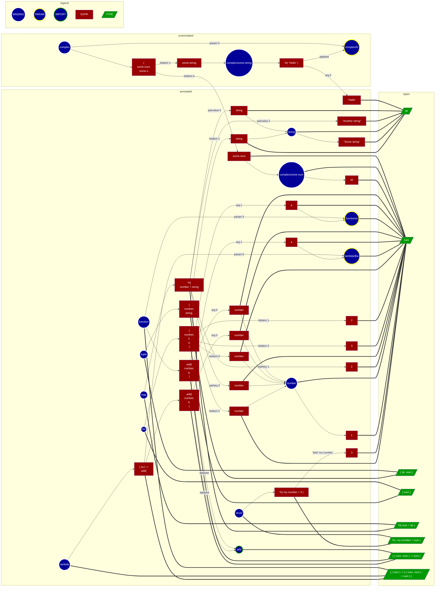

```mermaid
graph LR

subgraph annotated
add(("add")):::import
complex/$/ITEM-0/$["some-num"]:::expr
complex/some-num(("complex/some-num")):::binding
complex/some-num/$["42"]:::expr
complex/some-string/$/0/$["&ldquo;Hello&ldquo;"]:::expr
function(("function")):::binding
function/$["add(
	number,
	a,
)"]:::expr
function/$/0/$["number"]:::expr
function/$/1/$["a"]:::expr
function/a(("function/a")):::param
lambda(("lambda")):::binding
lambda/$["{ (a,) ->
		add(
			"]:::expr
lambda/$/$["add(
	number,
	a,
)"]:::expr
lambda/$/$/0/$["number"]:::expr
lambda/$/$/1/$["a"]:::expr
lambda/$/a(("lambda/$/a")):::param
list(("list")):::binding
list/$["[
	number,
	2,
	3,
]"]:::expr
list/$/ITEM-0/$["number"]:::expr
list/$/ITEM-1/$["2"]:::expr
list/$/ITEM-2/$["3"]:::expr
map(("map")):::binding
map/$["%[
	number  = string"]:::expr
map/$/PAIR-0-KEY/$["number"]:::expr
map/$/PAIR-0-VALUE/$["string"]:::expr
map/$/PAIR-1-KEY/$["2"]:::expr
map/$/PAIR-1-VALUE/$["&ldquo;Another string&ldquo;"]:::expr
number(("number")):::binding
number/$["1"]:::expr
string(("string")):::binding
string/$["&ldquo;Some string&ldquo;"]:::expr
struct(("struct")):::binding
struct/$["%( my-number = 3 )"]:::expr
struct/$/FIELD-my-number/$["3"]:::expr
tuple(("tuple")):::binding
tuple/$["(
	number,
	string,
"]:::expr
tuple/$/ITEM-0/$["number"]:::expr
tuple/$/ITEM-1/$["string"]:::expr
end

subgraph unannotated
complex(("complex")):::binding
complex/$["(
	some-num,
	some-s"]:::expr
complex/$/ITEM-1/$["some-string"]:::expr
complex/fn(("complex/fn")):::param
complex/some-string(("complex/some-string")):::binding
complex/some-string/$["fn( &ldquo;Hello&ldquo; )"]:::expr
end

subgraph types
str[/"str"/]:::type
num[/"num"/]:::type
LEFTPARENstrCOMMAnumRIGHTPAREN[/"( str, num )"/]:::type
LEFTBRACKETnumRIGHTBRACKET[/"[ num ]"/]:::type
PERCENTLEFTBRACKETnumEQUALstrRIGHTBRACKET[/"%[ num = str ]"/]:::type
PERCENTLEFTPAREN.my-numberEQUALnumRIGHTPAREN[/"%( .my-number = num )"/]:::type
LEFTBRACELEFTPARENnumCOMMAnumRIGHTPARENARROWnumENDBRACE[/"{ ( num, num ) -> num }"/]:::type
LEFTBRACELEFTPARENnumRIGHTPARENARROWLEFTBRACELEFTPARENnumCOMMAnumRIGHTPARENARROWnumENDBRACEENDBRACE[/"{ ( num ) -> { ( num, num ) -> num } }"/]:::type
LEFTBRACELEFTPARENnumRIGHTPARENARROWLEFTBRACELEFTPARENnumCOMMAnumRIGHTPARENARROWnumENDBRACEENDBRACE[/"{ ( num ) -> { ( num, num ) -> num } }"/]:::type
end


complex --> complex/$
complex -->| param 0 | complex/fn
complex/$ -->| listitem 1 | complex/$/ITEM-1/$
complex/$ -->| listitem 0 | complex/$/ITEM-0/$
complex/$/ITEM-0/$ --> complex/some-num
complex/$/ITEM-1/$ --> complex/some-string

complex/some-num --> complex/some-num/$

complex/some-string --> complex/some-string/$
complex/some-string/$ -->| arg 0 | complex/some-string/$/0/$
complex/some-string/$ -->| applyee | complex/fn

function --> function/$
function -->| param 0 | function/a
function/$ -->| arg 1 | function/$/1/$
function/$ -->| arg 0 | function/$/0/$
function/$ -->| applyee | add
function/$/0/$ --> number
function/$/1/$ --> function/a

lambda --> lambda/$
lambda/$ --> lambda/$/$
lambda/$ -->| param 0 | lambda/$/a
lambda/$/$ -->| arg 1 | lambda/$/$/1/$
lambda/$/$ -->| arg 0 | lambda/$/$/0/$
lambda/$/$ -->| applyee | add
lambda/$/$/0/$ --> number
lambda/$/$/1/$ --> lambda/$/a

list --> list/$
list/$ -->| listitem 2 | list/$/ITEM-2/$
list/$ -->| listitem 1 | list/$/ITEM-1/$
list/$ -->| listitem 0 | list/$/ITEM-0/$
list/$/ITEM-0/$ --> number


map --> map/$
map/$ -->| pairvalue 1 | map/$/PAIR-1-VALUE/$
map/$ -->| pairkey 1 | map/$/PAIR-1-KEY/$
map/$ -->| pairvalue 0 | map/$/PAIR-0-VALUE/$
map/$ -->| pairkey 0 | map/$/PAIR-0-KEY/$
map/$/PAIR-0-KEY/$ --> number
map/$/PAIR-0-VALUE/$ --> string


number --> number/$

string --> string/$

struct --> struct/$
struct/$ -->| field 'my-number' | struct/$/FIELD-my-number/$

tuple --> tuple/$
tuple/$ -->| listitem 1 | tuple/$/ITEM-1/$
tuple/$ -->| listitem 0 | tuple/$/ITEM-0/$
tuple/$/ITEM-0/$ --> number
tuple/$/ITEM-1/$ --> string

add === LEFTBRACELEFTPARENnumCOMMAnumRIGHTPARENARROWnumENDBRACE
complex/$/ITEM-0/$ === num
complex/some-num === num
complex/some-num/$ === num
complex/some-string/$/0/$ === str
function === LEFTBRACELEFTPARENnumRIGHTPARENARROWLEFTBRACELEFTPARENnumCOMMAnumRIGHTPARENARROWnumENDBRACEENDBRACE
function/$ === LEFTBRACELEFTPARENnumCOMMAnumRIGHTPARENARROWnumENDBRACE
function/$/0/$ === num
function/$/1/$ === num
function/a === num
lambda === LEFTBRACELEFTPARENnumRIGHTPARENARROWLEFTBRACELEFTPARENnumCOMMAnumRIGHTPARENARROWnumENDBRACEENDBRACE
lambda/$ === LEFTBRACELEFTPARENnumRIGHTPARENARROWLEFTBRACELEFTPARENnumCOMMAnumRIGHTPARENARROWnumENDBRACEENDBRACE
lambda/$/$ === LEFTBRACELEFTPARENnumCOMMAnumRIGHTPARENARROWnumENDBRACE
lambda/$/$/0/$ === num
lambda/$/$/1/$ === num
lambda/$/a === num
list === LEFTBRACKETnumRIGHTBRACKET
list/$ === LEFTBRACKETnumRIGHTBRACKET
list/$/ITEM-0/$ === num
list/$/ITEM-1/$ === num
list/$/ITEM-2/$ === num
map === PERCENTLEFTBRACKETnumEQUALstrRIGHTBRACKET
map/$ === PERCENTLEFTBRACKETnumEQUALstrRIGHTBRACKET
map/$/PAIR-0-KEY/$ === num
map/$/PAIR-0-VALUE/$ === str
map/$/PAIR-1-KEY/$ === num
map/$/PAIR-1-VALUE/$ === str
number === num
number/$ === num
string === str
string/$ === str
struct === PERCENTLEFTPAREN.my-numberEQUALnumRIGHTPAREN
struct/$ === PERCENTLEFTPAREN.my-numberEQUALnumRIGHTPAREN
struct/$/FIELD-my-number/$ === num
tuple === LEFTPARENstrCOMMAnumRIGHTPAREN
tuple/$ === LEFTPARENstrCOMMAnumRIGHTPAREN
tuple/$/ITEM-0/$ === num
tuple/$/ITEM-1/$ === str


classDef binding fill:#009, color:#fff, stroke: white, stroke-width: 4px
classDef expr fill:#900, color:#fff
classDef type fill:#090, color:#fff
classDef param fill:#009, color:#fff, stroke: yellow, stroke-width: 4px
classDef import fill:#009, color:#fff, stroke: green, stroke-width: 4px


subgraph legend
    LEGEND_BINDING((BINDING)):::binding
    LEGEND_PARAM((PARAM)):::param
    LEGEND_IMPORT((IMPORT)):::import
    LEGEND_EXPR[EXPR]:::expr
    LEGEND_TYPE[/TYPE/]:::type
end

```
