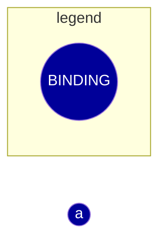
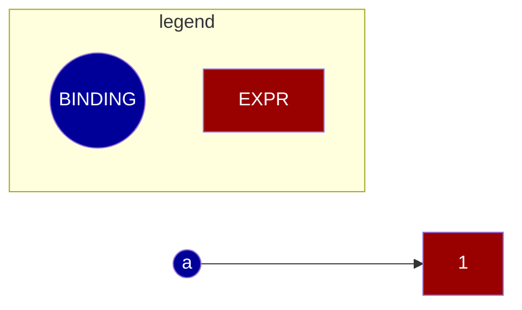
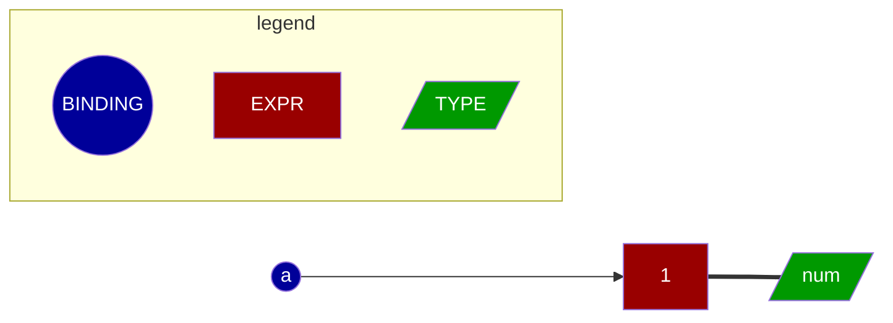
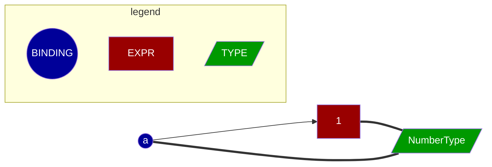

# Typegraph inference algorithm

```chakra
a = 1
```

The above is the simplest module. A single binding bound to a literal.

We start by adding all top-level bindings, in this case just `a`.

```
FOR x, index in module_bindings DO
    ADD_NODE binding_name(x, index) TO graph
END
```



We then walk through each node, and create nodes for each dependent expr recursively.The graph would look like:

```
FOR x, index IN module_bindings DO
    LET e = expr(x, index)
    ADD_NODE e TO graph
    FOR d,
END
```



And then we walk the leaf nodes, trying to add annotations. Here the only expression is the literal `1`, which has the type `num`



We would then move the type information down. A simple binding has the exact type of its dependent expression.



As we walk, we look for errors, copying problematic graph segments into a separate graph.

Let's look at a more complex example.

```chakra
%( add,  ...) = /stdlib/math

a = f(1)

f(n) = add(n, 1)
```

This is more complex example, we have a binding being added already typed through an import. We also have one top-level binding that depends on another.

First we stage all top-level bindings

```mermaid
graph TB %% Comment

    add((add)):::binding
    a((a)):::binding
    f((f)):::binding


    classDef binding fill:#009, color:#fff
    classDef expr fill:#900, color:#fff
    classDef type fill:#090, color:#fff
```

The binding `add` is coming from an import, so it is already typed:

```mermaid
graph TB %% Comment

    add((add)):::binding
    a((a)):::binding
    f((f)):::binding
    &structFieldAdd[/"{ (num, num) -> num }"/]:::type

    add === &structFieldAdd

    classDef binding fill:#009, color:#fff
    classDef expr fill:#900, color:#fff
    classDef type fill:#090, color:#fff
```

Next, we walk the next binding, `a`.

```mermaid
graph TB %% Comment

    add((add)):::binding
    a((a)):::binding
    f((f)):::binding
    &structFieldAdd[/"{ (num, num) -> num }"/]:::type
    a/$/apply["f(1)"]:::expr
    a/$/apply/arg1[f]:::expr
    a/$/apply/arg0[1]:::expr

    add === &structFieldAdd
    a --> a/$/apply
    a/$/apply -->|arg 0| a/$/apply/arg0
    a/$/apply -->|app| a/$/apply/arg1
    a/$/apply/arg1 --> f

    classDef binding fill:#009, color:#fff
    classDef expr fill:#900, color:#fff
    classDef type fill:#090, color:#fff
```

We staged that we next need to walk `f`.

```mermaid
graph TB %% Comment

    add((add)):::binding
    a((a)):::binding
    f((f)):::binding
    &structFieldAdd[/"{ (num, num) -> num }"/]:::type
    a/$/apply[a/$/apply]:::expr
    a/$/apply/lit[1]:::expr
    f/n((n)):::binding
    f/$/apply[f/$/apply]:::expr
    f/$/apply/lit[1]:::expr

    add === &structFieldAdd
    a --> a/$/apply
    a/$/apply -->|arg 0| a/$/apply/lit
    a/$/apply -->|app| f
    f --> f/$/apply
    f/$/apply -- app --> add
    f/$/apply -- arg0 --> f/n
    f/$/apply -- arg1 --> f/$/apply/lit

    classDef binding fill:#009, color:#fff
    classDef expr fill:#900, color:#fff
    classDef type fill:#090, color:#fff
```

Now that we have all local bindings walked, we can start resolving types of the leaves. The binding `n` is an argument, and has no type information. So it is skipped for now. The second argument is a literal, so we get the type of the literal, here a `num`.

```mermaid
graph TB %% Comment

    add((add)):::binding
    a((a)):::binding
    f((f)):::binding
    &structFieldAdd[/"{ (num, num) -> num }"/]:::type
    a/$/apply[a/$/apply]:::expr
    a/$/apply/lit[1]:::expr
    f/n((n)):::binding
    f/$/apply[f/$/apply]:::expr
    f/$/apply/lit[1]:::expr
    &num[/num/]:::type

    add === &structFieldAdd
    a --> a/$/apply
    a/$/apply -->|arg 0| a/$/apply/lit
    a/$/apply -->|app| f
    f --> f/$/apply
    f/$/apply -- app --> add
    f/$/apply -- arg0 --> f/n
    f/$/apply -- arg1 --> f/$/apply/lit
    f/$/apply/lit === &num


    classDef binding fill:#009, color:#fff
    classDef expr fill:#900, color:#fff
    classDef type fill:#090, color:#fff
```

Since the parent of `n` is an `apply` we can step up and try to resolve it. The applyee is `add`, so thea apply should have that type. We can annotate `n` as `num` and check that the second argument is a number as well, which it is. So we can also annotate the apply expression as the type `{ (num, num) -> num }`

```mermaid
graph TB %% Comment

    add((add)):::binding
    a((a)):::binding
    f((f)):::binding
    &structFieldAdd[/"{ (num, num) -> num }"/]:::type
    a/$/apply[a/$/apply]:::expr
    a/$/apply/lit[1]:::expr
    f/n((n)):::binding
    f/$/apply[f/$/apply]:::expr
    f/$/apply/lit[1]:::expr
    &num[/num/]:::type

    add === &structFieldAdd
    a --> a/$/apply
    a/$/apply -->|arg 0| a/$/apply/lit
    a/$/apply -->|app| f
    f --> f/$/apply
    f -->|param 0| f/n
    f/$/apply -- app --> add
    f/$/apply -- arg0 --> f/n
    f/$/apply -- arg1 --> f/$/apply/lit
    f/$/apply/lit === &num
    f/n === &num
    f/$/apply === &structFieldAdd[/"{ (num, num) -> num }"/]:::type
    classDef binding fill:#009, color:#fff
    classDef expr fill:#900, color:#fff
    classDef type fill:#090, color:#fff
```

Now that the expression has been annotated, we can step up and annotate the binding `f`. The apply expression has a return type of `num`, and the one parameter is also of type `num`, so we have everything we need to annotate.

```mermaid
graph TB %% Comment

    add((add)):::binding
    a((a)):::binding
    f((f)):::binding
    &structFieldAdd[/"{ (num, num) -> num }"/]:::type
    a/$/apply[a/$/apply]:::expr
    a/$/apply/lit[1]:::expr
    f/n((n)):::binding
    f/$/apply[f/$/apply]:::expr
    f/$/apply/lit[1]:::expr
    &num[/num/]:::type
    &fun001[/"{ (num) -> num }"/]:::type

    add === &structFieldAdd
    a --> a/$/apply
    a/$/apply -->|arg 0| a/$/apply/lit
    a/$/apply -->|app| f
    f --> f/$/apply
    f -->|param 0| f/n
    f/$/apply -- app --> add
    f/$/apply -- arg0 --> f/n
    f/$/apply -- arg1 --> f/$/apply/lit
    f/$/apply/lit === &num
    f/n === &num
    f/$/apply === &structFieldAdd[/"{ (num, num) -> num }"/]:::type
    f === &fun001
    classDef binding fill:#009, color:#fff
    classDef expr fill:#900, color:#fff
    classDef type fill:#090, color:#fff
```

Now we can move up to annotate the other argument of `a`'s apply expression which again is a number literal of type `num`.

```mermaid
graph TB %% Comment

    add((add)):::binding
    a((a)):::binding
    f((f)):::binding
    &structFieldAdd[/"{ (num, num) -> num }"/]:::type
    a/$/apply[a/$/apply]:::expr
    a/$/apply/lit[1]:::expr
    f/n((n)):::binding
    f/$/apply[f/$/apply]:::expr
    f/$/apply/lit[1]:::expr
    &num[/num/]:::type
    &fun001[/"{ (num) -> num }"/]:::type

    add === &structFieldAdd
    a --> a/$/apply
    a/$/apply -->|arg 0| a/$/apply/lit
    a/$/apply -->|app| f
    f --> f/$/apply
    f -->|param 0| f/n
    f/$/apply -- app --> add
    f/$/apply -- arg0 --> f/n
    f/$/apply -- arg1 --> f/$/apply/lit
    a/$/apply/lit === &num
    f/$/apply/lit === &num
    f/n === &num
    f/$/apply === &num
    f === &fun001
    a/$/apply === &num
    a === &num

    classDef binding fill:#009, color:#fff
    classDef expr fill:#900, color:#fff
    classDef type fill:#090, color:#fff
```

We can then check that the argument is correct for the applyee `f`, which it is, so we can then annotate `a` as `num` (the return type of the applyee). And this is the final annotated graph

```mermaid
graph TB %% Comment

    subgraph Expression
        a/$/apply[a/$/apply]:::expr
        a/$/apply/lit[1]:::expr
        f/$/apply[f/$/apply]:::expr
        f/$/apply/lit[1]:::expr
    end

    subgraph Bindings
        add((add)):::binding
        a((a)):::binding
        f((f)):::binding
        f/n((n)):::param
    end

    subgraph Types
        &structFieldAdd[/"{ (num, num) -> num }"/]:::type
        &num[/num/]:::type
        &fun001[/"{ (num) -> num }"/]:::type
    end


    a --> a/$/apply
    a/$/apply -->|app| f
    a/$/apply -->|arg 0| a/$/apply/lit
    f --> f/$/apply
    f -->|param 0| f/n
    f/$/apply -->|app| add
    f/$/apply -->|arg 0| f/n
    f/$/apply -->|arg 1| f/$/apply/lit

    add -.- &structFieldAdd
    f/$/apply/lit -.- &num
    f/$/apply -.- &fun001
    f -.- &fun001
    a/$/apply/lit -.- &num
    a/$/apply -.- &num
    a -.- &num
    f/n -.- &num

    classDef binding fill:#009, color:#fff
    classDef param fill:#00E, color:#fff, stroke-dasharray: 5 5, stroke: 4px
    classDef expr fill:#900, color:#fff
    classDef type fill:#090, color:#fff
```

Starting to think about the overall design of the data structure to hold the graph

```fs
type TypeGraph =
    { Nodes : string Set
      Types : Type Set
      Dependencies: Map<string, Dependency Set>
      Annotations: Map<string, Type>
      CurrentNode: string }

val addNode: string -> TypeGraph -> TypeGraph
val addType: Type -> TypeGraph -> TypeGraph
val annotateNode: string -> Type -> TypeGraph -> Result<TypeGraph, TypeError>
val addDependency: string -> Dependency -> Result<TypeGraph, TypeError>
val walk: TypeGraph -> TypeGraph option
val findNode: string -> TypeGraph -> string option
val nodeType: string -> TypeGraph -> Type option
```
