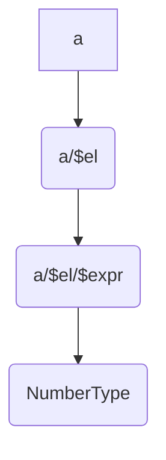
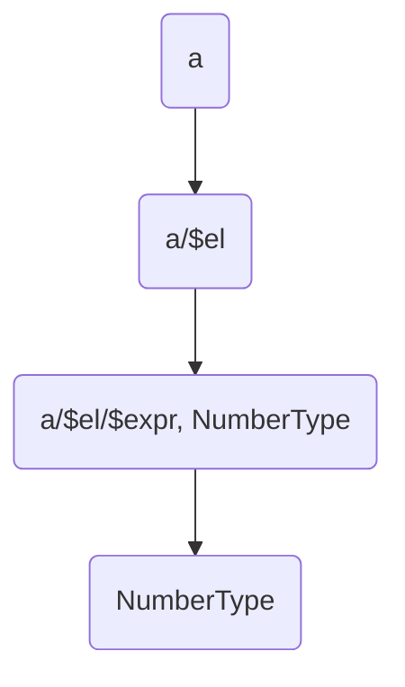

# Typegraph inference algorithm


```chakra
a = 1
```

The above is the simplest module.  A single binding bound to a literal.

The graph would look like:




We would then start at the leaf, and move the type information down.



```
BindingNode("a") <- ExprListNode("a/$el", NumberType) <- ExprNode("a/$el/$expr", NumberType) <- LiteralNode(NumberType)
```

```
BindingNode("a", NumberType) <- ExprListNode("a/$el", NumberType) <- ExprNode("a/$el/$expr", NumberType) <- LiteralNode(NumberType)
```

As we walk, we look for errors, copying problematic graph segments into a separate graph.

Let's look at a more complex example.

```chakra
math = /stdlib/math

a = f(1)

f(n) = math.add(n, 1)
```

This is more complex example, we have a binding being added already typed through an import.  We also have one top-level binding that depends on another.  This is the graph (There is a fair bit of elision below to focus on the relevant details):

```
BindingNode("math", StructType([("add", FunctionType([...]))]))
BindingNode("a") <- ExprListNode <- ExprList <- ApplyNode
```